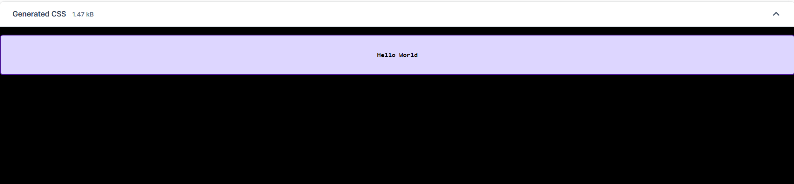
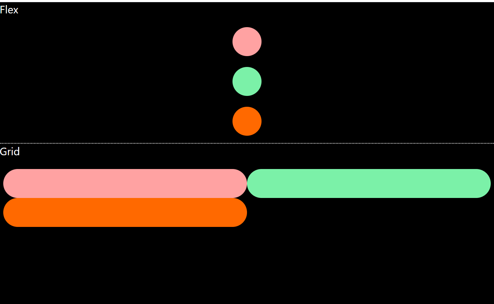
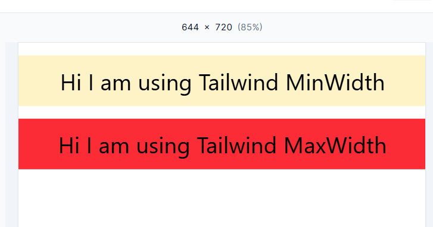
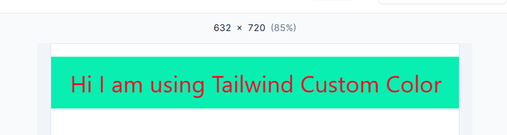
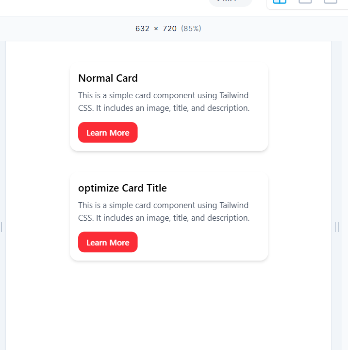

# 📘 Basic Tailwind concepts

- [Go To](https://tailwindcss.com/docs/min-width)

-For padding-> p{t/l/b/r}-{size}

-For margin-> m{t/l/b/r}-{size}

-text-[size] it will apply custom size. We can pass any custom value using []

---

## 💻 Code Snippet 1

```Basic Html & Tailwind css

<div class="bg-violet-200 h-auto my-4 border-2 border-violet-900 rounded-md p-2 w-full">
<h1 class="text-center font-mono text-[13px] text-black font-extrabold p-[20px] ">Hello World</h1>
</div>
```

## 🖼️ UI Screenshot

## 

## 💻 Flex Snippet

```Basic flex and grid concepts

<h2 class="text-white text-2xl">Flex</h2>
<div class="flex flex-col items-center justify-center mt-6 pb-4 space-y-6 border-b-2 border-white border-dotted">
  <div class="h-16 w-16 bg-red-300 rounded-full"></div>
  <div class="h-16 w-16 bg-green-300 rounded-full"></div>
  <div class="h-16 w-16 bg-orange-500 rounded-full"></div>
</div>
<h2 class="text-white text-2xl">Grid</h2>
<div class="grid grid-cols-2 mt-6 mx-2">
  <div class="h-16  bg-red-300 rounded-full"></div>
  <div class="h-16  bg-green-300 rounded-full"></div>
  <div class="h-16  bg-orange-500 rounded-full"></div>
</div>
```

## 🖼️ UI Screenshot



---

## 💻 min & max width Snippet

- max-[600px] / min-[600px] by this we can pass custom value of particular breakpoint

```Basic min & max width concepts

<h2 class="text-center text-4xl p-5 mt-5 sm:bg-amber-100 md:bg-green-300 lg:bg-red-500 xl:bg-blue-400 2xl:bg-yellow-400">
Hi I am using Tailwind MinWidth</h2>


<h2 class="text-center text-4xl p-5 mt-5 max-sm:bg-amber-100 max-lg:bg-red-500">Hi I am using Tailwind MaxWidth</h2>


```

## 🖼️ UI Screenshot



---

## 💻 Use Custom Color & assign it to variables [Go To Tailwind Theme variables](https://tailwindcss.com/docs/theme)

- text-[#f40823] Direct use colorcode

- bg-tealgreen : Assign tealgreen variables a color code

--- Html

```Code

<h2 class="text-center text-4xl p-5 mt-5 bg-tealgreen text-[#f40823]">
Hi I am using Tailwind Custom Color</h2>

```

--- CSS

```
@import "tailwindcss";

@theme {
  --color-tealgreen: #09efb1;
}

```

## 🖼️ UI Screenshot



---

## 💻 optimize and Reuse like normal css class

- This is a normal card

```Code

<div class="mx-auto mt-10 max-w-sm overflow-hidden rounded-2xl bg-white shadow-md">
  <div class="p-4">
    <h2 class="mb-2 text-xl font-semibold">Normal Card</h2>
    <p class="mb-4 text-gray-600">This is a simple card component using Tailwind CSS. It includes an image, title, and description.</p>
    <button class="rounded-xl bg-red-500 px-4 py-2 font-medium text-white">Learn More</button>
  </div>
</div>

```

- we can optimize it using @layer

--- Html

```code
<div class="card">
  <div class="p-4">
    <h2>optimize Card Title</h2>
    <p>This is a simple card component using Tailwind CSS. It includes an image, title, and description.</p>
    <button class="button">Learn More</button>
  </div>
</div>

```

--- CSS

```
@import "tailwindcss";

@layer base {
  h2{
    @apply text-xl font-semibold mb-2
  }

  p{
    @apply text-gray-600 mb-4
  }
}

@layer components {
  .card{
    @apply max-w-sm mx-auto mt-10 bg-white shadow-md rounded-2xl overflow-hidden
  }

  .button{
    @apply bg-red-500 text-white font-medium py-2 px-4 rounded-xl
  }
}

```

## 🖼️ UI Screenshot



---
